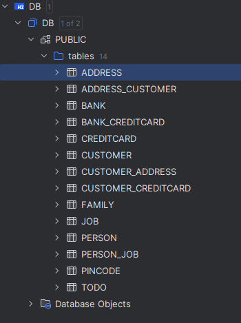
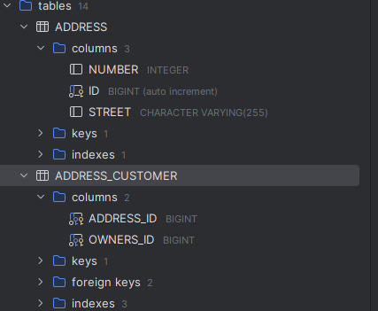
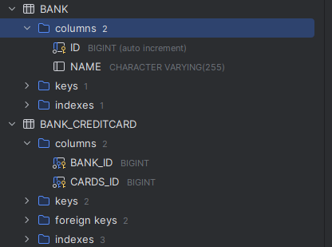
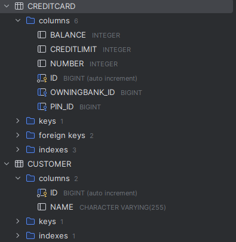
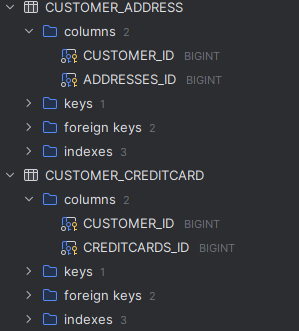

# DAT250 Expass 4
- Olav Høysæther Opheim

## Short report
Steps/Experiment:
- Step 1: I have forked the template project and followed the JPA tutorial.
- Step 2: I have implemented the domain model for credit card and the tests passes.

## Technical problems
- I had no issues during installation or using JPA.
- When working on part two i had issues with the database, and it was caused by me using "limit" as
a column name. Since "limit" is a reserved keyword in database i chaged the filed to "creditLimit".
- I decided at the start to use List and ArrayList as collection, but one of the test asserted that it was equal to a "Set". Therefore i had to change my lists to sets so that the test passed.
- The database tables are created automaticly by the hibernate "settings" we have created in the presistence.xml, i have made some minor modifications and just added the class files like we did in the example turotial. I tried
to override the standard names by using "@Table(name ="Address")" in the respective class, but that did not seem to work, but the tables were created as expected.

## Explanation of how i inspected the database tables and what tables werre created
I inspected the database by using the inbuilt database function in the IntelliJ IDEA. Here is screenshot of the tables created:

Database structure: 
Address & Address_Customer: 
Bank & Bank_creditcard: 
Creditcard & Customer: 
Customer_Address & Customer_CreditCard: 

## Pending issues
- There are no issues everything works as expected.